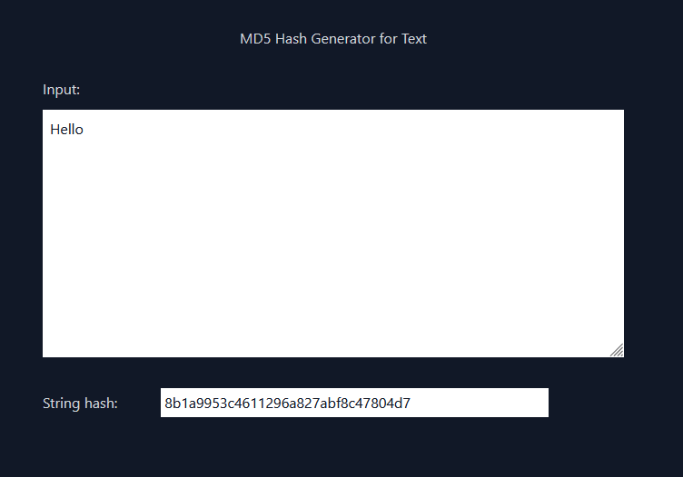

# md5-web

Generate MD5 Hash from text on the web using JavaScript.

## Made with
- [crypto-js](https://github.com/brix/crypto-js) to compute MD5
- [Parcel](https://v2.parceljs.org) as bundler
- [Vue 3](https://v3.vuejs.org) as web framework
- [Tailwind CSS](https://tailwindcss.com) for design

